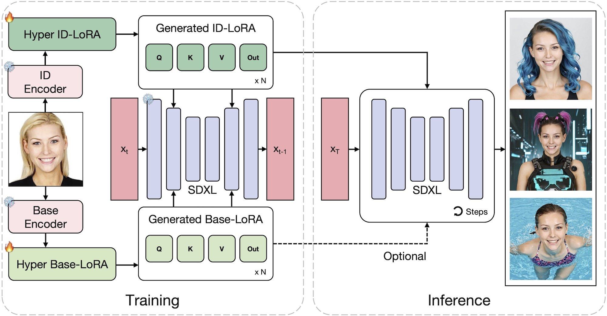
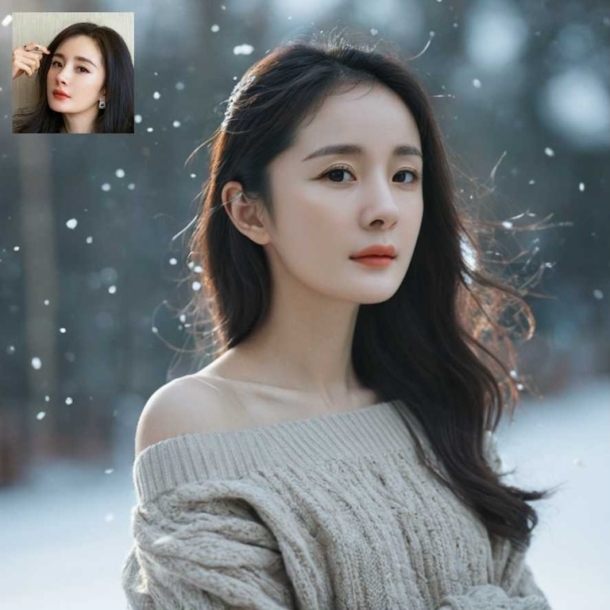
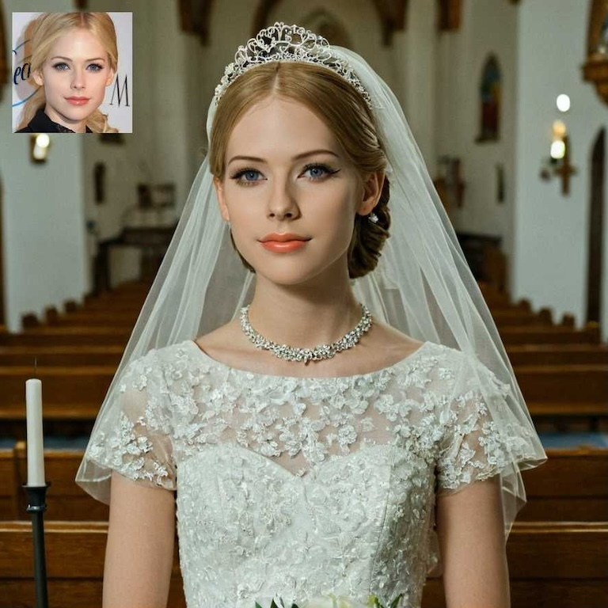
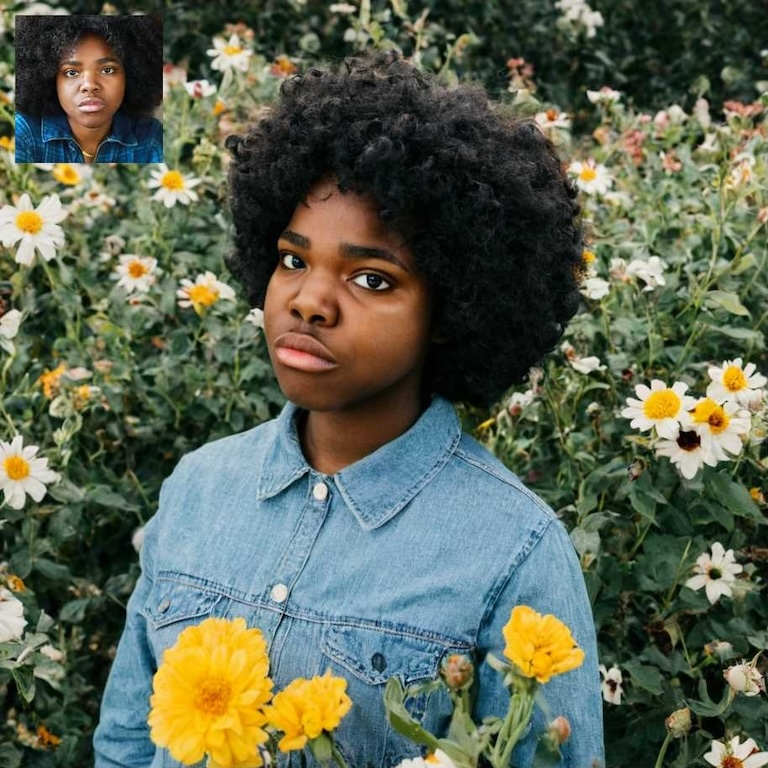
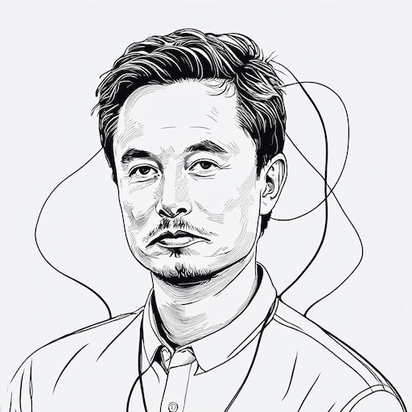

# <div align="center">HyperLoRA: Parameter-Efficient Adaptive Generation for Portrait Synthesis<br>CVPR 2025 (Highlight)</div>
<div align="center">
    <a href="https://lemonsky1995.github.io/" target="_blank">Mengtian Li</a><sup>*</sup>,
    <a href="https://openreview.net/profile?id=~Jinshu_Chen2" target="_blank">Jinshu Chen</a><sup>*</sup>,
    <a href="https://wanquanf.github.io/" target="_blank">Wanquan Feng</a><sup>*✉</sup>,
    <a href="https://scholar.google.com/citations?user=ac5Se6QAAAAJ" target="_blank">Bingchuan Li</a>,
    <a href="https://openreview.net/profile?id=~Fei_Dai1" target="_blank">Fei Dai</a>,
    <a href="https://openreview.net/profile?id=~Songtao_Zhao1" target="_blank">Songtao Zhao</a>,
    <a href="https://scholar.google.com/citations?user=9rWWCgUAAAAJ" target="_blank">Qian He</a>
    <br>
    Intelligent Creation, ByteDance
</div>
<br>
<div align="center">
    [<a href="https://lemonsky1995.github.io/hyperlora/" target="_blank">Project Page</a>]
    [<a href="https://arxiv.org/abs/2503.16944" target="_blank">ArXiv</a>]
</div>

## Abstract
Personalized portrait synthesis, essential in domains like social entertainment, has recently made significant progress. Person-wise fine-tuning based methods, such as LoRA and DreamBooth, can produce photorealistic outputs but need training on individual samples, consuming time and resources and posing an unstable risk. Adapter based techniques such as IP-Adapter freeze the foundational model parameters and employ a plug-in architecture to enable zero-shot inference, but they often exhibit a lack of naturalness and authenticity, which are not to be overlooked in portrait synthesis tasks. In this paper, we introduce a parameter-efficient adaptive generation method, namely HyperLoRA, that uses an adaptive plug-in network to generate LoRA weights, merging the superior performance of LoRA with the zero-shot capability of adapter scheme. Through our carefully designed network structure and training strategy, we achieve zero-shot personalized portrait generation (supporting both single and multiple image inputs) with high photorealism, fidelity, and editability.

## Overview

We explicitly decompose the HyperLoRA into a Hyper ID-LoRA and a Hyper Base-LoRA. The former is designed to learn ID information while the latter is expected to fit others, e.g. background and clothing. Such a design helps to prevent irreverent features leaking to ID-LoRA. During the training, we fix the weights of the pretrained SDXL base model and encoders, allowing only HyperLoRA modules updated by Backpropagation. At the inference stage, the Hyper ID-LoRA integrated into SDXL generates personalized images while the Hyper Base-LoRA is optional.

## Usage
### Create Model Folders
Navigate to your ComfyUI's ```models``` folder and create the following subfolders:
```
models/
├── hyper_lora/
│   ├── clip_processor/    # Directory for CLIP processor files
│   ├── clip_vit/          # Directory for CLIP ViT model files
│   └── hyper_lora/        # Directory for HyperLoRA model files
└── insightface/
    └── models/            # Directory for InsightFace model files
```

### Download Models
First, download the [CLIP processor](https://huggingface.co/openai/clip-vit-large-patch14/raw/main/preprocessor_config.json) to ```models/hyper_lora/clip_processor/clip_vit_large_14_processor```

Second, download the [CLIP ViT model](https://huggingface.co/openai/clip-vit-large-patch14/resolve/main/model.safetensors) and [config](https://huggingface.co/openai/clip-vit-large-patch14/raw/main/config.json) to ```models/hyper_lora/clip_vit/clip_vit_large_14```

Then, download the [antelopev2](https://github.com/deepinsight/insightface/tree/master/python-package#model-zoo) and unzip it to ```models/insightface/models```

Finally, download the [HyperLoRA model](https://huggingface.co/bytedance-research/HyperLoRA) to ```models/hyper_lora/hyper_lora```

We have released two versions of HyperLoRA. <b>sdxl_hyper_id_lora_v1_fidelity</b> offers better fidelity, while <b>sdxl_hyper_id_lora_v1_edit</b> provides better editability. Note that we trained for some additional steps using FP16 precision and distilled the 0.25x Base LoRA into the ID LoRA, which further reduced the model size and the GPU memory usage.

### Example Workflows
The workflows depend on [ComfyUI_ADV_CLIP_emb](https://github.com/BlenderNeko/ComfyUI_ADV_CLIP_emb) and [ComfyUI-Impact-Pack](https://github.com/ltdrdata/ComfyUI-Impact-Pack) plugins.

<table width="100%" style="text-align: center">
 <tr>
    <td width="25%" style="text-align: right"><b>Name</b></td>
    <td width="40%"><b>Workflow</b></td>
    <td width="35%"><b>Result</b></td>
 </tr>
 <tr>
    <td style="text-align: right">T2I</td>
    <td><a href="assets/HyperLoRA-T2I.json">HyperLoRA-T2I.json</a></td>
    <td></td>
 </tr>
 <tr>
    <td style="text-align: right">T2I + FaceDetailer</td>
    <td><a href="assets/HyperLoRA-T2I-FaceDetailer.json">HyperLoRA-T2I-FaceDetailer.json</a></td>
    <td></td>
 </tr>
 <tr>
    <td style="text-align: right">T2I + ControlNet</td>
    <td><a href="assets/HyperLoRA-T2I-ControlNet.json">HyperLoRA-T2I-ControlNet.json</a></td>
    <td></td>
 </tr>
 <tr>
    <td style="text-align: right">T2I + InstantID</td>
    <td><a href="assets/HyperLoRA-T2I-InstantID.json">HyperLoRA-T2I-InstantID.json</a></td>
    <td></td>
 </tr>
</table>

We fixed the random seed in all workflows so that the results can be fully reproduced. All the input images required by these workflows can be found in the ```assets``` folder.

### Tips
**IMPORTANT:**
- Please confirm that all model and config files are placed in correct directories.
- The text prompt should start with the LoRA trigger words `fcsks fxhks fhyks, ` to enable LoRA.
- It is recommended to set `stop_at_clip_layer` to `-2` to align with our training config.

HyperLoRA is not compatible with all SDXL base models. We have tested that it is compatible with [LEOSAM's HelloWorld XL 3.0](https://civitai.com/models/43977?modelVersionId=262973), [CyberRealistic XL v1.1](https://civitai.com/models/312530?modelVersionId=395041), and [RealVisXL v4.0](https://civitai.com/models/139562?modelVersionId=344487), but incompatible with [ArienMixXL v4.0](https://civitai.com/models/118913?modelVersionId=322265). Among them, RealVisXL v4.0 may achieve the best results.

<table width="100%" style="text-align: center">
 <tr>
    <td width="25%"><b>LEOSAM 😊</b></td>
    <td width="25%"><b>CyberRealistic 😊</b></td>
    <td width="25%"><b>RealVis 😊</b></td>
    <td width="25%"><b>ArienMix 😭</b></td>
 </tr>
 <tr>
    <td></td>
    <td></td>
    <td></td>
    <td></td>
 </tr>
</table>

The LoRA weight are usually around 0.75 to 0.85. If the prompt is very long, you can appropriately increase the weight (as well as the weight of trigger words). If better editability is required, you can appropriately decrease the weight.

<table width="100%" style="text-align: center">
 <tr>
    <td width="25%"><b>Sunglasses</b></td>
    <td width="25%"><b>Baby</b></td>
    <td width="25%"><b>Sketch</b></td>
    <td width="25%"><b>Sand Sculpture</b></td>
 </tr>
 <tr>
    <td></td>
    <td></td>
    <td></td>
    <td></td>
 </tr>
</table>

Due to the limited resolution of the trained faces, it is recommended to use a FaceDetailer plugin to repair small faces or use ControlNet to increase stability. In addition, combining HyperLoRA with the ControlNet of InstantID can usually further improve the facial similarity.

Furthermore, HyperLoRA can also provide a good initialization for LoRA training. You can obtain a better ID LoRA with only about 50 steps of finetuning.

## Disclaimer and Licenses
Our code is under the GPL 3.0 license. You can use, modify, and distribute it, with derivative works also under GPL 3.0. Our models follow the CC BY-NC 4.0 license, allowing non-commercial sharing and adaptation with proper credit. Third-party models like SDXL, CLIP, and InsightFace are subject to their original licenses.

This project aims to advance the field of generative AI. We disclaim any liability for misuse or unauthorized use of the code, models, or related materials. You must comply with all relevant licenses and laws when using this plugin.

## Citation
If you find HyperLoRA useful in your research, please kindly cite our paper:
```bibtex
@article{li2025hyperlora,
    title={HyperLoRA: Parameter-Efficient Adaptive Generation for Portrait Synthesis}, 
    author={Mengtian Li and Jinshu Chen and Wanquan Feng and Bingchuan Li and Fei Dai and Songtao Zhao and Qian He},
    journal={arXiv preprint arXiv:2503.16944},
    year={2025}
}
```
